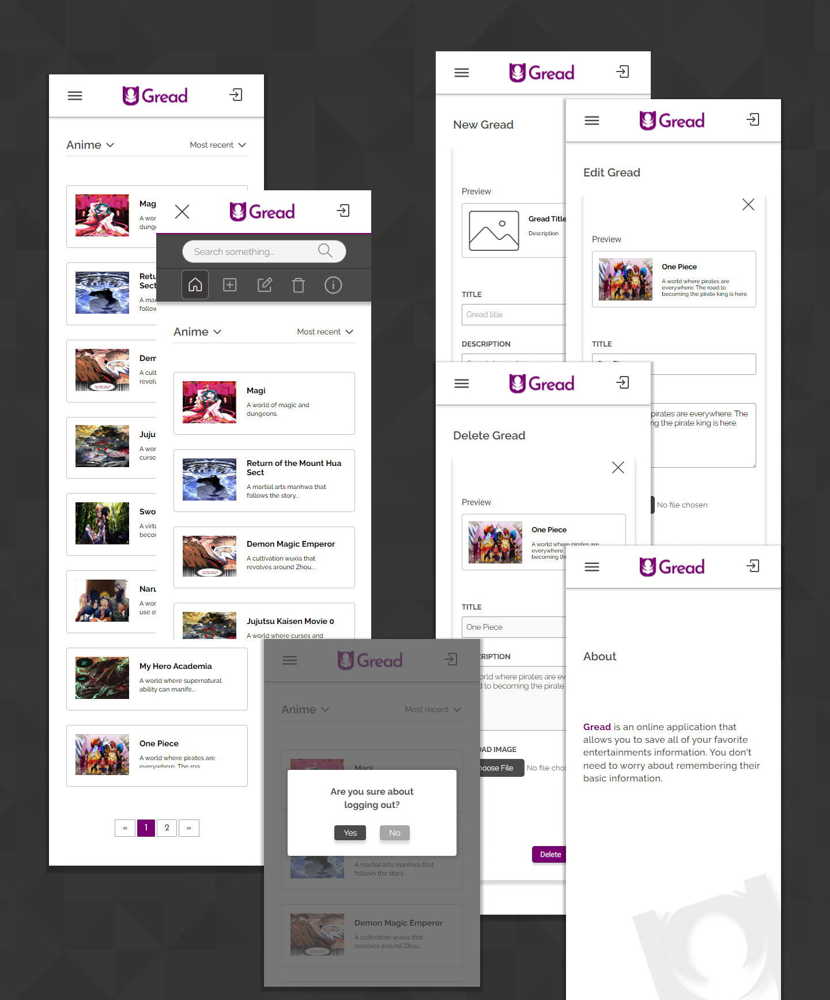

# Gread Web Application

This application allows you to save all of your favorite media entertainments basic information.

## Screenshot

### Mobile Logged Out

### Mobile Logged In

### Desktop Logged Out

### Desktop Logged In

## Building Process

### **Frontend Development**

#### **Built with:**

- HTML
- CSS
- Flexbox
- CSS Grid
- JS
- Mobile-first workflow

#### Workflow

I will start from the structure of the website using (HTML), followed by the aesthetics using (CSS), the functionality through (JS), and (PHP) as the backend. This process will be repeated over and over for each pages. This is what I was expecting. What actually happened is that instead of having a repeated cycle, the thing I tackled is the rough draft of UI using (HTML, CSS, JS). For the backend, a lot of functionality like (Search, Filter, Static Template generation) uses PHP and MySQL. Sometimes I also needed to use Javascript to do something like redirection and DOM manipulation.

#### Design Software

- Figma

### Backend Development

#### **Built with:**

- PHP
- MYSQL

## Learning Outcomes and Experience

### HTML

The bulk of HTML code I've written lies inside the PHP. Since there are two possible state (Logged in and Not logged in). The markup is totally different between the two states. So I need to display either one depending on user state, and using PHP conditional statements. There are some modification needed depending on the feature I'm trying to implement. I managed to solidify and deepen my understanding and practical application of markup language.

### CSS

This web application uses a lot of elements that needs some sort of design manipulation. I find myself being able to do the things I want when it comes to using CSS (Fail and test loop). Naturally my stylesheet is not perfect and there are a lot of loopholes but I managed to thinker and learn a lot from testing. Specially when it comes to responsive design and the usefulness of relative unit (rem) instead of absolute unit like (px).
There are some difference between the actual product and the design since the design itself is made with haste.
I feel like I'm getting a hang of styling and using the fundamentals of CSS, but there are a lot more to learn.

### JavaScript

I've written a lot of functions and I also get a taste of some ajax and xmlhttprequest. I have a pretty clear grasp of how JSON and fetchAPI and backend script function but I don't think It's necessary to use JSON for this project. Since most of the MVC(View) part are also generated through the backend, I just decided to use the backend itself for some features such as (Search, filter, and pagination, editing Live preview). The scripts I've written using JavaScript mostly handles the UI and UX. I also used this language for some redirection. The mobile navigation has a lot of things going on since when a user clicks on the menu icon, the javascript will first calculate the height of the element and add an appropriate styling depending on devices viewport. Now I'm not that uncomfortable when creating some basic features and manipulating the DOM.

### PHP

This is actually my first backend project other than the course project in University of Michigan Specialization MOOC(Web Application for Everybody) by Dr.Chuck. After finishing the first 3 courses of the Specialization, I decided to create this application to practically create something of my own. I know how the MVC works so I just dive in to it and I managed to do some basic backend features like (Image upload, Save user data in database, search, filter, Log in, and Sign up). I also handled the status and error updates to keep user updated. I've used the 'blowfish' algorithm for password hashing. I also learned big time the url encoding and decoding. Of course I also make surer to prevent SQL injection using PDO (Php data object) and HTML injections.

### MySQL

I divided the table into three parts (users <= record => record_img) which creates a One-to-many relation (between users to record) and One-to-One relation (record to record_img).I need to think deeply how the relation between each information i need relates to one another in this case or else it would be harder for me for future development. I can now select, update, insert, and delete what I want from the database. Querying basic is a lot more simple than I thought.

## Challenges

This are some of the main problem I've faced along the way:

- Image upload script.
- Redirection / Routing
- Navigation (Identifying state depending on URL)
- Pagination (Identifying state depending on URL)
- Database (where a single account that has multiple record which uses a single image.)
  I needed to do add some selector helper column (date_recorded) and sync it with the actual record. Deleting the image from the user image file path requires some set of condition to be met as well to prevent other image that references to the same image return (not found).
- Responsiveness (difference between px and rem in terms of responsiveness).
- CRUD (Multi reference image deletion logic)

## Future Developments

There are still a lot of improvements that can be made for this application. Since this is just the early version there are still some bugs and fixes that needs to be done, but the original purpose of this app is working pretty well. After building this for almost three weeks, I know that it is a pretty simple application without too much going on. I will use this to measure my current skill and build a lot more useful and challenging projects in the near future in order to improve. Here are some of the features and improvements I'm considering for this project:

- User profile
- Settings (records-per-page, dark mode, account deletion, password recovery, password reset)
- Hashing user name and using it to create the users directory instead of their emails
- Upload script file input verification.
- Image compression
- Multiple addition, editing, deletion of records.
- Code cleaning and structure
- Namespace
- Security
- UI/UX
- Use some Frameworks
- Caching
- Performance
- SEO
- Accessibility
- PWA
- Best Practices

The last five (5) items came from google dev tools Lighthouse audit. Since I have my own circumstances and problems, I only priotized in making the audit above or equal to 90 (GREEN) for now.

## Author

- LinkedIn - [Roweme](https://www.linkedin.com/in/roweme-santos-389653230/)
- Frontend Mentor - [Rouwe](https://www.frontendmentor.io/profile/rouwe)
